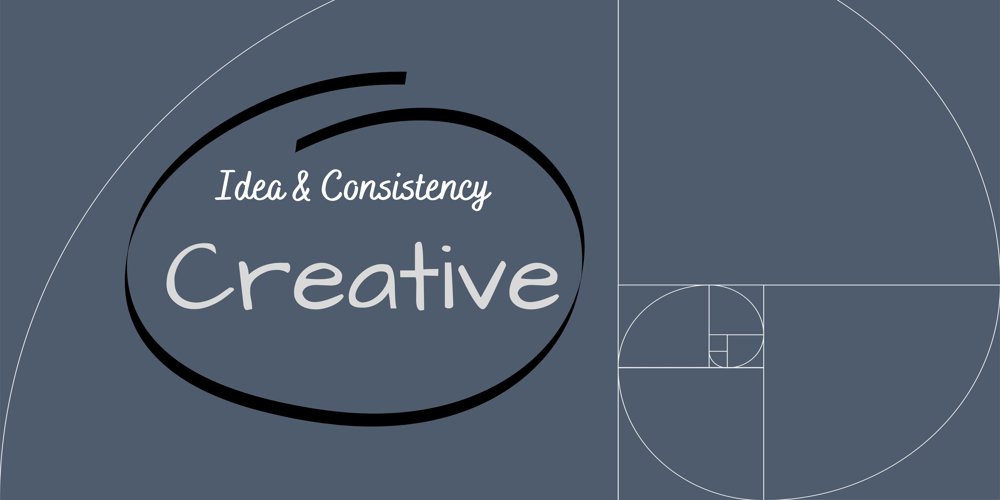
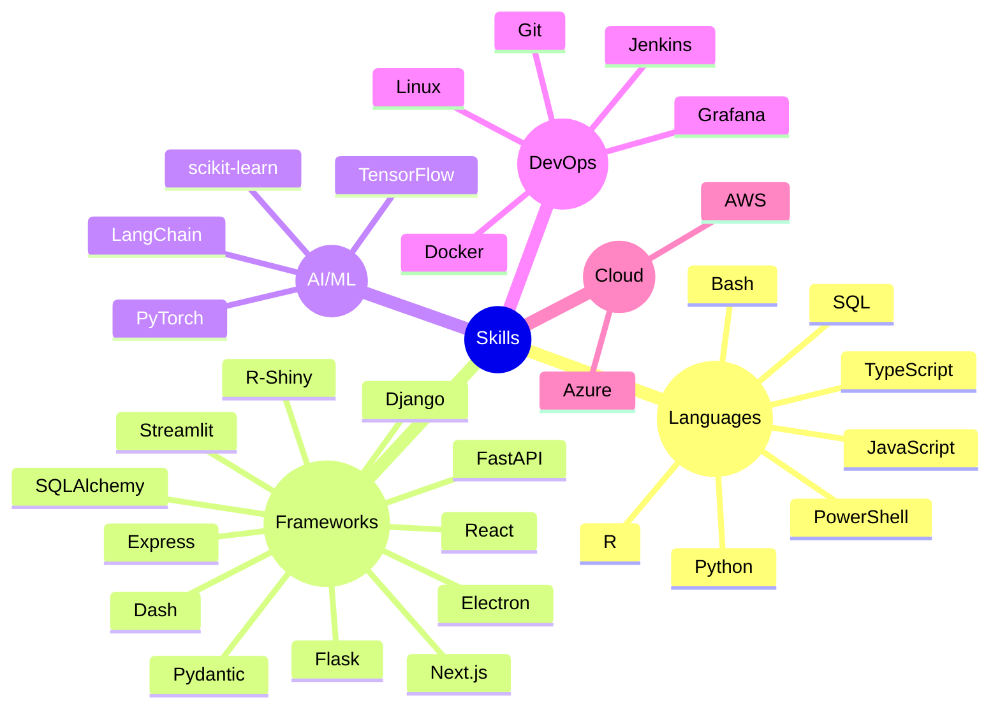

 

 

&nbsp;

---

## 🧠 About Me

- 🔭 Currently building **[Ctrl-Alt-Deploy](https://e-choness.github.io/ctrl-alt-deploy/blog/)** — a blog at the intersection of AI and engineering
- 🤖 Passionate about intelligent systems, automation, and developer tooling
- 🌱 Always exploring what's next at the edge of code and intelligence

---

## 🛠️ Skills

---

## 📊 GitHub Stats

  

 

  
  &nbsp;
  

---

## 🏆 Trophies

  

---

## 📈 Contribution Activity

  

---

  <i>⚡ "The best way to predict the future is to invent it." — Alan Kay</i>

