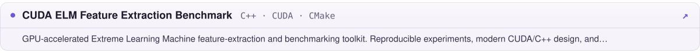
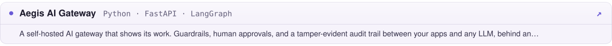
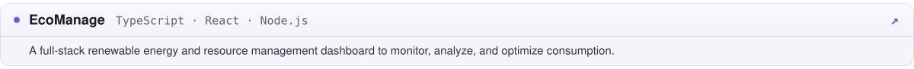
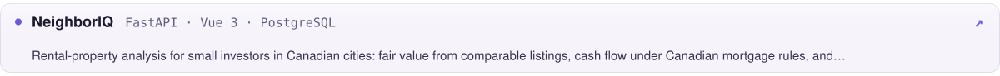
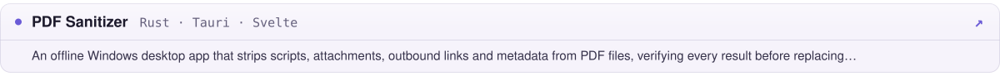

<a href="https://e-choness.github.io/portfolio-site/">
  <picture>
    <source media="(prefers-color-scheme: dark)" srcset="assets/generated/hero-dark.svg">
    
  </picture>
</a>

<!-- DOCK:START -->
<a href="https://e-choness.github.io/portfolio-site/#/about"><picture><source media="(prefers-color-scheme: dark)" srcset="assets/generated/dock-about-dark.svg"></picture></a>
<a href="https://e-choness.github.io/portfolio-site/#/proj"><picture><source media="(prefers-color-scheme: dark)" srcset="assets/generated/dock-projects-dark.svg"></picture></a>
<a href="https://e-choness.github.io/portfolio-site/#/blog"><picture><source media="(prefers-color-scheme: dark)" srcset="assets/generated/dock-blog-dark.svg"></picture></a>
<a href="https://e-choness.github.io/portfolio-site/#/arcade"><picture><source media="(prefers-color-scheme: dark)" srcset="assets/generated/dock-arcade-dark.svg"></picture></a>
<a href="https://e-choness.github.io/portfolio-site/#/term"><picture><source media="(prefers-color-scheme: dark)" srcset="assets/generated/dock-terminal-dark.svg"></picture></a>
<a href="https://e-choness.github.io/portfolio-site/assets/resume.pdf"><picture><source media="(prefers-color-scheme: dark)" srcset="assets/generated/dock-resume-dark.svg"></picture></a>
<a href="https://www.linkedin.com/in/echoyin0451/"><picture><source media="(prefers-color-scheme: dark)" srcset="assets/generated/dock-linkedin-dark.svg"></picture></a>
<a href="https://x.com/_echo_yin"><picture><source media="(prefers-color-scheme: dark)" srcset="assets/generated/dock-x-dark.svg"></picture></a>
<a href="mailto:echoybl1123@gmail.com"><picture><source media="(prefers-color-scheme: dark)" srcset="assets/generated/dock-email-dark.svg"></picture></a>
<!-- DOCK:END -->

<a href="https://e-choness.github.io/portfolio-site/#/term">
  <picture>
    <source media="(prefers-color-scheme: dark)" srcset="assets/generated/desktop-dark.svg">
    
  </picture>
</a>

## Projects

<!-- PROJECTS:START -->
<a href="https://e-choness.github.io/portfolio-site/#/proj/feature-extraction"><picture><source media="(prefers-color-scheme: dark)" srcset="assets/generated/project-feature-extraction-dark.svg"></picture></a> 
<a href="https://e-choness.github.io/portfolio-site/#/proj/aegis"><picture><source media="(prefers-color-scheme: dark)" srcset="assets/generated/project-aegis-dark.svg"></picture></a> 
<a href="https://e-choness.github.io/portfolio-site/#/proj/eco-manage"><picture><source media="(prefers-color-scheme: dark)" srcset="assets/generated/project-eco-manage-dark.svg"></picture></a> 
<a href="https://e-choness.github.io/portfolio-site/#/proj/neighbor-iq"><picture><source media="(prefers-color-scheme: dark)" srcset="assets/generated/project-neighbor-iq-dark.svg"></picture></a> 
<a href="https://e-choness.github.io/portfolio-site/#/proj/pdf-sanitizer"><picture><source media="(prefers-color-scheme: dark)" srcset="assets/generated/project-pdf-sanitizer-dark.svg"></picture></a> 
<!-- PROJECTS:END -->

## Activity

<picture>
  <source media="(prefers-color-scheme: dark)" srcset="assets/generated/skyline-dark.svg">
  
</picture>

Everything above is rebuilt daily by <a href="scripts/build.mjs"><code>scripts/build.mjs</code></a> from the <a href="https://e-choness.github.io/portfolio-site/">EchoOS</a> site data and my public contribution calendar.
