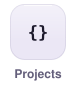
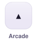
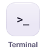
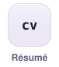
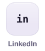
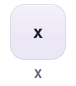

<a href="https://e-choness.github.io/portfolio-site/">
  <picture>
    <source media="(prefers-color-scheme: dark)" srcset="assets/generated/hero-dark.svg">
    
  </picture>
</a>

<!-- DOCK:START -->
<a href="https://e-choness.github.io/portfolio-site/#/about"><picture><source media="(prefers-color-scheme: dark)" srcset="assets/generated/dock-about-dark.svg"></picture></a>
<a href="https://e-choness.github.io/portfolio-site/#/proj"><picture><source media="(prefers-color-scheme: dark)" srcset="assets/generated/dock-projects-dark.svg"></picture></a>
<a href="https://e-choness.github.io/portfolio-site/#/blog"><picture><source media="(prefers-color-scheme: dark)" srcset="assets/generated/dock-blog-dark.svg"></picture></a>
<a href="https://e-choness.github.io/portfolio-site/#/arcade"><picture><source media="(prefers-color-scheme: dark)" srcset="assets/generated/dock-arcade-dark.svg"></picture></a>
<a href="https://e-choness.github.io/portfolio-site/#/term"><picture><source media="(prefers-color-scheme: dark)" srcset="assets/generated/dock-terminal-dark.svg"></picture></a>
<a href="https://e-choness.github.io/portfolio-site/assets/resume.pdf"><picture><source media="(prefers-color-scheme: dark)" srcset="assets/generated/dock-resume-dark.svg"></picture></a>
<a href="https://www.linkedin.com/in/echoyin0451/"><picture><source media="(prefers-color-scheme: dark)" srcset="assets/generated/dock-linkedin-dark.svg"></picture></a>
<a href="https://x.com/_echo_yin"><picture><source media="(prefers-color-scheme: dark)" srcset="assets/generated/dock-x-dark.svg"></picture></a>
<a href="mailto:echoybl1123@gmail.com"><picture><source media="(prefers-color-scheme: dark)" srcset="assets/generated/dock-email-dark.svg"></picture></a>
<!-- DOCK:END -->

<a href="https://e-choness.github.io/portfolio-site/#/term">
  <picture>
    <source media="(prefers-color-scheme: dark)" srcset="assets/generated/desktop-dark.svg">
    
  </picture>
</a>

## Latest writing

<!-- LATEST-POSTS:START -->
- **[The Clean Envelope: Debugging Production Pipelines Without Touching PII](https://e-choness.github.io/portfolio-site/#/blog/PII-masking)**  
  Jul 14, 2026 · 11 min read
- **[The Honest Parts: Residency, Tenancy, and Saying No](https://e-choness.github.io/portfolio-site/#/blog/the-honest-parts-residency-tenancy-scope)**  
  May 27, 2026 · 8 min read
- **[Guardrails That Tell You the Truth About Streaming](https://e-choness.github.io/portfolio-site/#/blog/guardrails-that-tell-you-the-truth)**  
  May 20, 2026 · 9 min read
- **[Rebuilding an AI Gateway as a Framework, Not a Product](https://e-choness.github.io/portfolio-site/#/blog/rebuilding-aegis-as-a-framework)**  
  May 13, 2026 · 9 min read
- **[Advanced RAG: Hybrid Search with Sparse and Dense Retrieval Plus Cross Encoder Reranking](https://e-choness.github.io/portfolio-site/#/blog/advanced-rag)**  
  Dec 29, 2025 · 17 min read
<!-- LATEST-POSTS:END -->

## Projects

<!-- PROJECTS:START -->
| Project | What it is | Stack | Links |
|---|---|---|---|
| [**CUDA ELM Feature Extraction Benchmark**](https://e-choness.github.io/portfolio-site/#/proj/feature-extraction) | GPU-accelerated Extreme Learning Machine feature-extraction and benchmarking toolkit. | C++, CUDA, CMake, GoogleTest | [code](https://github.com/e-choness/feature_extraction_cuda_elm) · [live](https://e-choness.github.io/feature_extraction_cuda_elm) |
| [**Aegis AI Gateway**](https://e-choness.github.io/portfolio-site/#/proj/aegis) | A plugin-first AI gateway framework. | Python, FastAPI, LangGraph, Docker | [code](https://github.com/e-choness/aegis) · [live](https://huggingface.co/spaces/echoness/aegis-server) |
| [**EcoManage**](https://e-choness.github.io/portfolio-site/#/proj/eco-manage) | A full-stack renewable energy and resource management dashboard to monitor, analyze, and optimize consumption. | TypeScript, React, Node.js, MongoDB | [code](https://github.com/e-choness/eco-manage) |
| [**NeighborIQ**](https://e-choness.github.io/portfolio-site/#/proj/neighbor-iq) | Rental-property analysis for small investors in Canadian cities: fair value from comparable listings, cash flow under Canadian mortgage rules, and neighbourhood open data. | FastAPI, Vue 3, PostgreSQL, PostGIS | [code](https://github.com/e-choness/NeighborIQ) · [docs](https://e-choness.github.io/NeighborIQ/) |
| [**PDF Sanitizer**](https://e-choness.github.io/portfolio-site/#/proj/pdf-sanitizer) | An offline Windows desktop app that strips scripts, attachments, outbound links and metadata from PDF files, verifying every result before replacing the original. | Rust, Tauri, Svelte, JavaScript | [code](https://github.com/e-choness/pdf-sanitizer) · [live](https://e-choness.github.io/pdf-sanitizer/) |
<!-- PROJECTS:END -->

## Activity

<picture>
  <source media="(prefers-color-scheme: dark)" srcset="assets/generated/skyline-dark.svg">
  
</picture>

Everything above is rebuilt daily by <a href="scripts/build.mjs"><code>scripts/build.mjs</code></a> from the <a href="https://e-choness.github.io/portfolio-site/">EchoOS</a> site data and my public contribution calendar.
